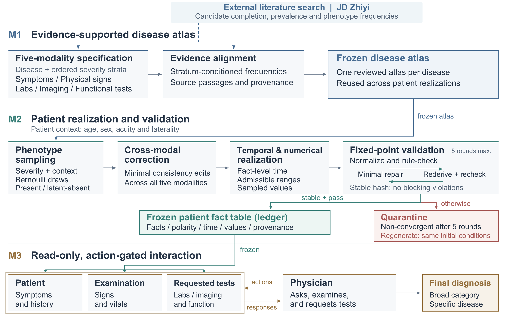

# PhenoPatient

M1–M3 reproducibility bundle.

This repository contains the research code and frozen synthetic outputs for
reproducing M1–M3. It is separate from the manuscript's LaTeX source archive.



Workflow figure from the accompanying paper. The external literature search
shown in M1 is not implemented in this release; an evidence provider must be
supplied separately.

The code implements M1 disease-level phenotype atlases, M2 patient realization
(including deterministic fact-ledger validation), and the original M3
doctor–patient–oracle interaction. The frozen data contain 50 atlases and 1,000
synthetic patients (20 per disease). This is research software, not a clinical
decision-support system.

## Contents

| Path | Purpose |
| --- | --- |
| `figures/phenopatient_workflow.png` | Paper workflow diagram for M1–M3 |
| `src/phenopatient/` | M1, M2 (including ledger validation), original M3 and their shared utilities/entrypoints |
| `data/m1_atlases/` | 50 released disease-level atlas CSVs |
| `data/final_patients/phenopatient_1000.csv` | One browsable table of 1,000 patient states |
| `data/final_ledgers/phenopatient_1000_fact_ledgers.jsonl.gz` | The corresponding 1,000 converged M2 patient fact ledgers |
| `data/m25_time_models/phenopatient_1000_m25.jsonl.gz` | Only the M2 time models required to verify those ledgers against the patient rows |
| `scripts/prepare_m3_runtime.py` | Offline reconstruction of 50 M3-ready CSVs and their minimal sidecars |
| `scripts/verify_m3_outputs.py` | Read-only post-run coverage and current-ledger check for all frozen cases |
| `scripts/checksums.py`, `data/manifests/files.sha256` | File integrity checks |
| `tests/` | Focused M1–M3, ledger, entrypoint and packaging tests |

The M1–M3 core modules are copied from anonymous-review release commit
`192aa6f82b47cdc83cee9177488c16b1763aa399`. The combined entrypoint
`run_phenopatient.py` has only its optional M5 baseline flag/import/call removed
so this bundle has no M5 dependency. No comparator implementations or
human-evaluation traces/scores are included. The M2.5 export contains only
`case_id`, the public disease-group key and a structured time model; it does
not include the original run's module I/O logs, prompt/response records or
service configuration. The source code necessarily retains its prompt templates
for generating new patients and interactions. The 50 atlas CSVs match the local
anonymous artifact snapshot, but were not part of the cited code commit; the
manifest pins this release's bytes, not independent upstream provenance.

## Install and verify without model calls

Python 3.11 or later is recommended.

```bash
python -m venv .venv
source .venv/bin/activate
python -m pip install -r requirements.txt
python -m pytest -q
python scripts/checksums.py
python scripts/prepare_m3_runtime.py --output-root /path/to/new/m3_runtime
```

`prepare_m3_runtime.py` does **not** call a model. It creates 50 per-disease
CSVs (one M1 template row plus 20 patient rows each), 1,000 per-patient ledger
sidecars, minimal time-model/ledger metadata sidecars and per-CSV ledger manifests.
It verifies all 1,000 `case_id` links, canonical ledger hashes and input hashes
before leaving an output directory. Its output path must not already exist.
The consolidated patient CSV or compressed ledger file alone is **not** a
direct input to the original M3 runner.

## Run M3 for the frozen patients

After the offline preparation above, configure your own OpenAI-compatible
model endpoint, key and model name, then run:

```bash
export PHENOPATIENT_LLM_URL=...       # supply privately
export PHENOPATIENT_API_KEY=...       # supply privately
export PHENOPATIENT_MODEL_NAME=...    # supply privately
python src/phenopatient/virtual_clinical_interaction.py \
  --csv_dir /path/to/new/m3_runtime --num_workers 2
python scripts/verify_m3_outputs.py --runtime-root /path/to/new/m3_runtime
```

This command makes live model calls and writes interaction results into the
prepared CSVs. It does not regenerate the frozen M1/M2 states. Model behavior
may vary across services and runs; the included hashes verify the frozen
patient/ledger relationship, not identical newly generated conversations.
The original M3 runner can exit successfully after silently skipping an
unreadable/missing CSV or unfinished patient. Its exit code is **not** proof of
1,000 completed interactions. Run the separate read-only verification command
above; it requires all 50 CSVs, exactly the frozen 1,000 case IDs, an interaction
with a diagnosis-stage marker (excluding diagnosis-generation failure) and
matching current ledger metadata. It exits nonzero if any case is incomplete.

## Generate a new M1→M2→M3 run

The same privately configured model service is required. The input file must
contain at least `case_id`, age, gender/sex and diagnosis (CSV, JSON or JSONL).
The code also accepts optional department, ICD code, acuity and stage. For a
small input, for example:

```bash
python src/phenopatient/run_phenopatient.py \
  --input_file /path/to/minimal_cases.csv \
  --output_root /path/to/new/output \
  --total_workers 2 --seed_parallel 1
```

This path calls the model for generation and interaction. Evidence integration
is optional and requires a separately supplied provider; private retrieval
responses are not distributed. The frozen atlas/patient tables are reference
outputs, not a promise of byte-identical regeneration by another model.

## Release boundary

No MIMIC-IV source records, source OSCE tables, method-specific comparator
tables, human-rating material, credentials or original private Git history are
included. The data are synthetic; rule convergence is an engineering check,
not proof of clinical correctness, prevalence or patient-care safety. See
`DATA_CARD.md` for details.

**License:** the earlier anonymous artifact license was for peer review only.
No code/data reuse license is included in this repository; public visibility
alone does not grant permission to reuse or redistribute it. The owners may
choose and publish a suitable license separately.
